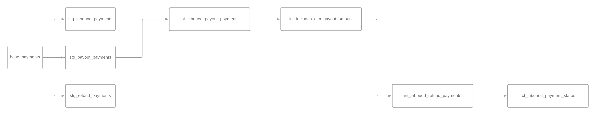

# Notes

## DAG-driven-development

As the complexity of this exercise increased in comparison with the first one, I have decided to replicate the workflow I follow when working at similar projects in homyspace. A tl;dr of this workflow would be:

1. I define the acceptance criteria by which the exercise would be considered as complete. In this case, is to obtain the same results as the official BigQuery apportioning-payments table.
2. Before starting the development process, I use Lucidchart to do a poc of how the DAG that ends in the final tbale will look like. When I do so I compare it to the current full DAG of the project, in order to keep everything as DRY as possible (such as limiting the number of joins) in order to keep the project as performant and maintainable as it can get.

For this exercise, the DAG looks like this:

